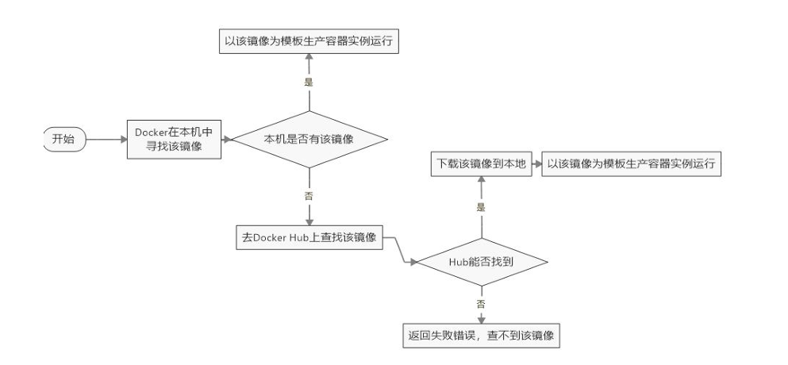

# Docker 

## 一、Docker 基本概念

**Docker 官网：[Docker：加速容器应用程序开发](https://www.docker.com/)**

**Docker 作用：[Docker是什么?它的优点与作用是什么?我们为什么使用docker?_叫我三胖哥哥的博客-CSDN博客](https://blog.csdn.net/weixin_44232093/article/details/124297427)**


**Docker 基于go 语言开发，解决了运行环境和配置问题的软件容器，方便做持续集成并有助于整体发布的容器虚拟化技术。**


**Docker 三要素**

1. **镜像**
2. **容器**
3. **仓库**


**Docker 教程**

1. [尚硅谷Docker实战教程（docker教程天花板）_哔哩哔哩_bilibili](https://www.bilibili.com/video/BV1gr4y1U7CY/?spm_id_from=333.999.0.0&vd_source=f34fbb94411729427c7957728faf0df2)
2. [docker-docker是什么-docker入门实战-docker教程-docker优点-docker特点-docker概念-为什么要用docker-嗨客网 (haicoder.net)](https://haicoder.net/docker/docker-course.html)


## 二、Docker 面试题

### 链接类

- [【Docker】虚悬镜像(Dangling Image)介绍和处理方法_自牧君的博客-CSDN博客](https://blog.csdn.net/Sihang_Xie/article/details/128319227#:~:text=虚悬镜像介绍 虚悬镜像 (Dangling Image) 指的是仓库名 (镜像名) 和标签,TAG 都是  的镜像。 如下图所示。 在实际开发中，在构建或者删除镜像时出错会有一定概率出现虚悬镜像。 虚悬镜像在实际开发中产生概率不高，然而，一旦虚悬镜像生成，就可能对你的系统造成一些潜在的风险。)

- [docker常规操作——启动、停止、重启容器实例-CSDN博客](https://blog.csdn.net/Michel4Liu/article/details/80889977)

### 总结类


## 三、Docker 安装

### Centos 7.9 安装 Docker

#### 环境说明

````
操作系统：Centos 7.9

IP:192.168.1.10   (NAT网络模式)
````

**开始安装 **

**官网安装文档：[在 CentOS 上安装 Docker 引擎 |Docker 文档](https://docs.docker.com/engine/install/centos/)**

**官网安装文档：[安装 Docker 引擎 |Docker 文档](https://docs.docker.com/engine/install/)**

#### 卸载 Docker

```
sudo yum remove docker \
                  docker-client \
                  docker-client-latest \
                  docker-common \
                  docker-latest \
                  docker-latest-logrotate \
                  docker-logrotate \
                  docker-engine
```

#### 安装依赖环境

```
[root@master1 ~]# yum -y install gcc gcc-c++ gcc*
```

#### 安装需要的软件

```
[root@master1 ~]# sudo yum install -y yum-utils
```

#### 设置国内仓库

```
[root@master1 ~]# yum-config-manager --add-repo http://mirrors.aliyun.com/docker-ce/linux/centos/docker-ce.repo
```

#### 更新 yum 软件包索引

```
[root@master1 ~]# yum makecache fast
```

#### 安装 Docker

```
[root@master1 ~]# yum install docker-ce docker-ce-cli containerd.io
```

#### Docker 命令

```
[root@master1 ~]# systemctl start docker     # 启动 Docker
[root@master1 ~]# systemctl status docker    # 查看 Docker 状态
[root@master1 ~]# docker version             # 查看 Docker 版本信息
[root@master1 ~]# docker run hello-world     # 第一天命令，测试是否安装成功
[root@master1 ~]# systemctl stop docker      # 停止 Docker


systemctl   enable   docker     # 开机启动 Docker
docker   info     # 查看 Docker 详细信息
```

#### 配置阿里云加速器

[容器镜像服务 (aliyun.com)](https://cr.console.aliyun.com/cn-hangzhou/instances/mirrors)

```
sudo mkdir -p /etc/docker

sudo tee /etc/docker/daemon.json <<-'EOF'
{
  "registry-mirrors": ["https://w2owbf6l.mirror.aliyuncs.com"]
}
EOF

sudo systemctl daemon-reload
sudo systemctl restart docker
```


------


## 四、Docker 的使用

### run 做了什么



### docker 命令

#### 启动类命令

```
systemctl start docker	# 启动 Docker

systemctl stop docker	# 停止 Docker

systemctl restart docker	# 重启 Docker

systemctl status docker		# 查看 Docker 状态

systemctl enable docker		# 开机自启动 Docker

docker info					# 显示 Docker 概要，详细信息

docker --help 				# Docker 帮助命令

docker 具体命令 --help 		# Docker 帮助命令
```

#### 镜像命令

```
docker images		# 列出本地主机上的镜像

-a :列出本地所有的镜像（含历史映像层）
-q :只显示镜像ID。


REPOSITORY：表示镜像的仓库源
TAG：镜像的标签版本号
IMAGE ID：镜像ID
CREATED：镜像创建时间
SIZE：镜像大小

同一仓库源可以有多个TAG版本，代表这个仓库源的不同个版本，我们使用REPOSITORY:TAG 来定义不同的镜像。如果你不指定一个镜像的版本签，例如你只使用ubuntu，docker 将默认使用ubuntu:latest 镜像
```

```
docker search 某个 XXX 镜像名字    # 查找远程仓库镜像的名字

--limit : 只列出 N 个镜像，默认25个

docker search--limit 5 redis
```

```
# 镜像下载
docker pull 镜像名字[:TAG]
docker pull 镜像名字 没有TAG就是最新版
```

```
# docker system df 查看镜像/容器/数据卷所占的空间
docker system df
```

```
docker rmi 某个 XXX 镜像名字ID # 镜像的删除
 
docker rmi -f 镜像ID   # 删除单个
  
docker rmi -f 镜像名1:TAG 镜像名2:TAG   # 删除多个

docker rmi -f $(docker images -qa)     # 全部删除
```


#### Docker 容器命令

##### 拉取 Ubuntu 镜像

```
[root@master1 ~]# docker pull ubuntu

[root@master1 ~]# docker images
```


##### 运行镜像，生成容器

##### 不推荐写法

```
[root@master1 ~]# docker run ubuntu		# 无交互模式
```

##### 推荐写法

```
[root@master1 ~]# docker run -it ubuntu /bin/bash


-i：以交互模式运行容器，通常与-t同时使用；
-t：为容器重新分配一个伪输入终端，通常与-i 同时使用；
也即启动交互式容器(前台有伪终端，等待交互)；


/bin/bash：放在镜像名后的是命令，这里我们希望有个交互式Shell，因此用的是/bin/bash。


[root@master1 ~]# docker run -it --name=myu1 bash

--name:表示给容器取一个名字
```

##### 查看 docker 运行的容器

```
[root@master1 ~]# docker ps
-a :列出当前所有正在运行的容器+历史上运行过的。
-l :显示最近创建的容器。
-n：显示最近n个创建的容器。
-q :静默模式，只显示容器编号。
```

##### 容器的基本命令

```
exit	# 退出容器并停止（不推荐）

ctrl+p+q	# 退出容器，容器不停止

启动已经停止的容器：docker start 容器 ID 或者容器名

重启容器：docker restart  容器 ID 或者容器名

停止容器：docker stop  容器 ID 或者容器名

强制停止容器：docker kill 容器ID或者容器名
```

##### 容器的删除

```
docker rm 容器ID  # 删除容器

docker rm -f $(docker ps -a -q)  # 删除多个容器
```

##### 重要命令

```
# 拉取 redis 镜像
[root@master1 ~]# docker pull redis:6.0.8

# 运行 redis 镜像 （ctrl+c 直接退出）
[root@master1 ~]# docker run -it redis:6.0.8

# 在大部分的场景下，我们希望docker的服务是在后台运行的，我们可以过-d 指定容器的后台运行模式。docker run-d 容器名
[root@master1 ~]# docker run -d redis:6.0.8

# 查看容器日志
docker logs 容器 ID

# 查看容器内运行的进程
docker top 容器 I

# 查看容器内部细节
docker inspect 容器 ID

# 运行一个 Ubuntu 容器 （ctrl+c 直接退出）
[root@master1 ~]# docker run -it ubuntu /bin/bash

[root@master1 ~]# docker exec -it f2d26a31b2c3 /bin/bash   # 重新进入退出的容器，这种进入方式，使用 exit 退出，不会关闭容器


# 容器主机文件拷贝
[root@master1 ~]# docker exec -it 1af2f81a40db /bin/bash	# 进入容器

root@1af2f81a40db:~# cd /tmp/
root@1af2f81a40db:/tmp# touch a.tat
root@1af2f81a40db:/tmp# ls
a.tat

# 退出容器，主机配置
[root@master1 ~]# docker cp 1af2f81a40db:/tmp/a.tat /主机文件夹
```

##### 导入导出容器

```
export 导出容器的内容留作为一个tar归档文件[对应import命令]
import 从 tar 包中的内容创建一个新的文件系统再导入为镜像[对应export]

# 语法
docker export 容器ID > 文件名.tar
cat 文件名.tar | docker import - 镜像用户/镜像名:镜像版本号

案例
[root@master1 ~]# docker export f2d26a31b2c3 > abcd.tar  # 打包容器
 
[root@master1 ~]# cat abcd.tar | docker import - yhx/ubuntu:3.7  # 生成镜像，运行镜像
```

#### commit 命令

##### 下载 ubuntu 镜像

```
[root@master1 ~]# docker pull ubuntu
```

##### 运行容器

```
[root@master1 ~]# docker run -it ubuntu /bin/bash
```

##### 更新软件包，并安装 vim

```
root@f5688c9a84e1:/# apt-get update

root@f5688c9a84e1:/# apt-get -y install vim
```

##### 开始使用 commit 创建镜像


```
# 退出容器
root@f5688c9a84e1:/# exit
exit

# 创建镜像
[root@master1 ~]# docker commit -m="添加版本" -a="yhx" f5688c9a84e1 yyhh:1.2.3
sha256:bb341d4e93cb4e6700a28d8d86df785a81eab77691830f9e9a2cfa3a25a606e7
```

```
# 查看是否创建成功
[root@master1 ~]# docker images
REPOSITORY   TAG       IMAGE ID       CREATED         SIZE
yyhh         1.2.3     bb341d4e93cb   7 seconds ago   189MB
```

##### 测试新镜像

```
# 停掉现在所有容器
[root@master1 ~]# docker ps
CONTAINER ID   IMAGE     COMMAND       CREATED      STATUS       PORTS     NAMES
f5688c9a84e1   ubuntu    "/bin/bash"   2 days ago   Up 2 hours             eager_hodgkin
[root@master1 ~]# docker stop f5688c9a84e1
f5688c9a84e1


# 运行新的镜像 （添加了新的功能，并可以使用）
[root@master1 ~]# docker images
REPOSITORY   TAG       IMAGE ID       CREATED         SIZE
yyhh         1.2.3     bb341d4e93cb   7 minutes ago   189MB
yhx/ubuntu   3.7       02e9ecc4fbf6   2 days ago      72.8MB
ubuntu       latest    ba6acccedd29   2 years ago     72.8MB
redis        6.0.8     16ecd2772934   3 years ago     104MB
[root@master1 ~]# docker run -it bb341d4e93cb /bin/bash
```

### 本地镜像推送阿里云

1. [26_本地镜像发布到阿里云_哔哩哔哩_bilibili](https://www.bilibili.com/video/BV1gr4y1U7CY?p=26&vd_source=f34fbb94411729427c7957728faf0df2)


### 镜像推送私有仓库

1. [27_docker私有库简介_哔哩哔哩_bilibili](https://www.bilibili.com/video/BV1gr4y1U7CY?p=27&vd_source=f34fbb94411729427c7957728faf0df2)
2. [Docker搭建本地私有仓库_docker创建私有仓库-CSDN博客](https://blog.csdn.net/kele_baba/article/details/119457524)


### Docker 容器卷

- 什么是容器卷：[什么是Docker容器数据卷，该如何使用它 - 知乎 (zhihu.com)](https://zhuanlan.zhihu.com/p/447494706)
- [Docker入门到实践 (四) docker容器数据卷与数据卷容器_docker容器卷-CSDN博客](https://blog.csdn.net/qq_39135287/article/details/102987288)

#### 创建一个容器卷

[root@master1 ~]# docker run -it --privileged=true -v /宿主机绝对目录:/容器内目录 镜像名

```
[root@master1 ~]# docker run -it --privileged=true -v /tmp/host_data:/tmp/docker_data --name=u1 ubuntu


# 测试一下 （宿主机和容器可以互相传输文件）
root@a44bd84c1f35:/# cd /tmp/docker_data/
root@a44bd84c1f35:/tmp/docker_data# 
root@a44bd84c1f35:/tmp/docker_data# touch dockerin.txt
root@a44bd84c1f35:/tmp/docker_data# ls
dockerin.txt


[root@master1 ~]# cd /tmp/host_data/
[root@master1 host_data]# ls
dockerin.txt

# 查看数据卷是否挂载成功
[root@master1 host_data]# docker inspect 容器ID


# 小知识
容器卷可以修改读写权限
```

Docker挂载主机目录访问如果出现cannot open directory .: Permission denied

解决办法：在挂载目录后多加一个--privileged=true参数即可


如果是CentOS7安全模块会比之前系统版本加强，不安全的会先禁止，所以目录挂载的情况被默认为不安全的行为，

在SELinux里面挂载目录被禁止掉了额，如果要开启，我们一般使用--privileged=true命令，扩大容器的权限解决挂载目录没有权限的问题，也即使用该参数，container内的root拥有真正的root权限，否则，container内的root只是外部的一个普通用户权限。


#### 容器卷的继承

1. [Docker入门：容器卷——容器持久化，实现容器间继承和数据共享-CSDN博客](https://blog.csdn.net/weixin_37926734/article/details/123278466)


## 五、Docker 安装常用软件说明

#### tomcat 的安装

官方镜像收缩网址：https://hub.docker.com/（需要 VPN）

Tomcat 的搜索结果：https://hub.docker.com/_/tomcat

```
# 安装 Tomcat
[root@master1 ~]# docker pull tomcat

# 查看指定的镜像
[root@master1 ~]# docker images tomcat

# 启动 Tomcat
[root@master1 ~]# docker run -d -p 8080:8080 --name t1 tomcat
a731e26d156fb10bda6c6c743bf2d8812f2bc432e802ad9e982799124e013fc2

# 进入容器
[root@master1 ~]# docker exec -it a731e26d156f /bin/bash
root@a731e26d156f:/usr/local/tomcat# 

# 修改配置
root@a731e26d156f:/usr/local/tomcat# rm -r webapps
root@a731e26d156f:/usr/local/tomcat# mv webapps.dist webapps

# 访问本机IP+端口即可访问
```


#### MySQL 的安装

```
# 安装 MySQL
[root@master1 ~]# docker pull mysql:5.7

# 运行 MySQL 并设置密码
[root@master1 ~]# docker run -p 3306:3306 -e MYSQL_ROOT_PASSWORD=123456 -d mysql:5.7

# 进入容器
[root@master1 ~]# docker exec -it 362622fcdfee /bin/bash

# 登录 MySQL
[root@master1 ~]# docker exec -it 362622fcdfee /bin/bash
root@362622fcdfee:/# mysql -uroot -p123456
```

##### 问题

MySQL 容器被删除，数据丢失怎么办

答：给 MySQL 挂容器卷。


## 六、Docker 高级篇

### MySQL 主从复制

1. [41_mysql主从复制docker版_哔哩哔哩_bilibili](https://www.bilibili.com/video/BV1gr4y1U7CY/?p=41&spm_id_from=pageDriver&vd_source=f34fbb94411729427c7957728faf0df2)


### Dockerfile

- Dockerfile 是用来构建 Docker 镜像的文本文件，是由一条条构建镜像所需的指 令和参数构成的脚本。

  

- Dockerfile 内容基础知识

  1：每条保留字指令都必须为大写字母且后面要跟随至少一个参数 

  2：指令按照从上到下，顺序执行 

  3：#表示注释

  4：每条指令都会创建一个新的镜像层并对镜像进行提交


- Dockerfile 指令
  1.[Docker Dockerfile | 菜鸟教程 (runoob.com)](https://www.runoob.com/docker/docker-dockerfile.html)
  2.https://juejin.cn/post/7085176928465846308


### Docker 网络

#### Docker 的网络模式

1. [Docker学习：容器五种(3+2)网络模式 | bridge模式 | host模式 | none模式 | container 模式 | 自定义网络模式详解-CSDN博客](https://blog.csdn.net/succing/article/details/122433770)
2. [全网最详细的Docker网络教程详解 - 掘金 (juejin.cn)](https://juejin.cn/post/7041923410649153543)


#### Docker 网络命令

```
# 查看网络
[root@master2 ~]# docker network ls

# 查看网络数据源
[root@master2 ~]# docker network inspect XXX网络名字

# 删除网络
[root@master2 ~]# docker network rm XXX网络名字
```


